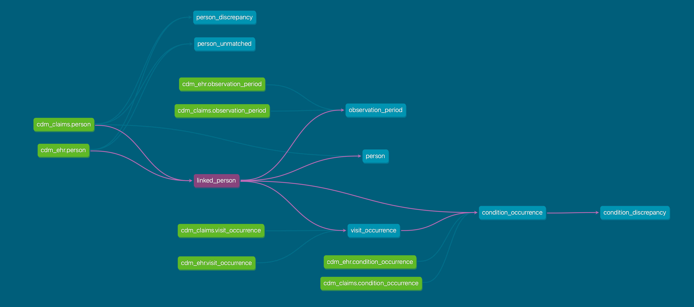

# OMOP Data Linkage with dbt [WIP]

## Overview

This work-in-progress dbt package is designed to facilitate the linkage of OMOP CDM databases from different sources—specifically EHR (Electronic Health Records) and Claims databases. Currently, the package supports PostgreSQL with 2 incoming data sources. The plan is to extend support to more data sources. The package provides a series of SQL models to:

- Match persons across databases based on `person_source_value`
- Pool other tables (e.g., `visit_occurrence`, `condition_occurrence`, `observation_period`) from OMOP CDM with updated `person_id`s
- Validate and identify discrepancies in key attributes like gender and year of birth
- Identify temporal discrepancies in `condition_occurrence`



## Getting Started

### Pre-installation Steps

1. **Create New PostgresDB for Linked Data**: Initialize a new PostgreSQL database where the linked data will reside.
2. **Set Up FDW (Foreign Data Wrapper)**: Configure FDW for the two incoming data sources (EHR and Claims) to enable cross-database queries.

You may leverage this DDL template to create the FDW for each incoming data source:

```sql
CREATE EXTENSION IF NOT EXISTS postgres_fdw;

CREATE SERVER omop_ehr FOREIGN DATA WRAPPER postgres_fdw OPTIONS (host '{hostname}', port '{port}', dbname '{dbname}');

CREATE USER MAPPING FOR {host_user} SERVER omop_ehr OPTIONS (user '{foreign_user}', password '{password}');

CREATE SCHEMA IF NOT EXISTS cdm_ehr;

IMPORT FOREIGN SCHEMA {foreign_schema} FROM SERVER omop_ehr INTO cdm_ehr;
```

3. **Run OMOP DDL for the New Linked Schema**: Execute [the DDL scripts](https://github.com/OHDSI/CommonDataModel/tree/main/inst/ddl/5.4/postgresql) to create the necessary OMOP tables in the new linked database.

### Installation

4. **Install dbt**: If you haven't already, [install dbt](https://docs.getdbt.com/dbt-cli/installation). Make sure to install the Postgres-compatible version (`dbt-postgres`).
5. **Clone this repository**: Clone this dbt package repository into your local machine.

### Configuration

6. **Configure your `profiles.yml`**: Update your dbt profiles to point to your Postgres instances where the OMOP databases reside.
7. **Configure `models/sources.yml`**: Edit this file to specify where the incoming data sources (EHR and Claims) are located.

## Models

Here is a list of the main models in this package:

### Linkage Models

- [`linked_person.sql`](models/linkage/linked_person.sql): Matches persons from EHR and Claims databases based on `person_source_value`.

### Validation and Discrepancy Models

- `person_discrepancy.sql`: Identifies discrepancies in `gender_concept_id` and `year_of_birth` in the `person` table.
- `temporal_discrepancy_condition_occurrence.sql`: Identifies temporal discrepancies in the `condition_occurrence` table.

### Summary Models

- `person_summary.sql`: Provides a summary of the number of matched, unmatched, and total persons in each source.

## Running the Package

To build the models, navigate to the directory containing the `dbt_project.yml` file and run:

```bash
dbt run
```

## Contributing

If you encounter any issues or have suggestions for improvements, please open an issue or submit a pull request.
